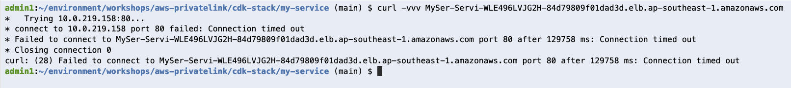

### 1. Create Cloud9 IDE
### 2. Install tools
```
cd ~/environment
git clone https://github.com/keshavbaweja-git/workshops.git
cd workshops/aws-privatelink/bin
./install-tools.sh
```
### 3. Deploy ECS service
```
cd ~/environment/workshops/aws-privatelink/cdk-stack/my-service
cdk synth
cdk deploy
```
You will be prompted to proceed with stack deployment

When complete, this stack would have deployed
- A VPC with public and private subnets with name starting with "MyServiceStack/" 
- An ECS Cluster with name starting with "MyServiceStack"

- An ECS Service with name backed by two tasks "MyServiceStack-Service" with one task instance

- A Private Network Load Balancer with name starting with "MySer-Servi"


### 4. Configure ECS service security group
The ECS service created by the CDK stack has a security group associated with it. At this moment, this security group does not allow inbound traffic from private NLB provisioned. Due to this the health checks for NLB are failing and the ECS task is being recreated repeatedly. Let's correct this by updating the ECS service security group.

- Determine the internal IP addresses assigned to private NLB
```
aws ec2 describe-network-interfaces \
--filters Name=description,Values="ELB net/<load-balancer-name>/<load-balancer-id>" \
--query 'NetworkInterfaces[*].PrivateIpAddresses[*].PrivateIpAddress' \
--output text
```


- Now we add two inbound rules to the security group associated with the ECS service to allow traffic from private NLB internal IP addresses.


- Once done, the Load Balance Target Group will show up as healthy.


### 5. Test private NLB access
Let's try to access the ECS service from the NLB private DNS name. This will not work as the Cloud9 IDE is hosted in a different VPC with no route to the private NLB in the VPC created by our CDK stack.


### 6. Create VPC Endpoint Service


### 6. Create VPC Endpoint 


