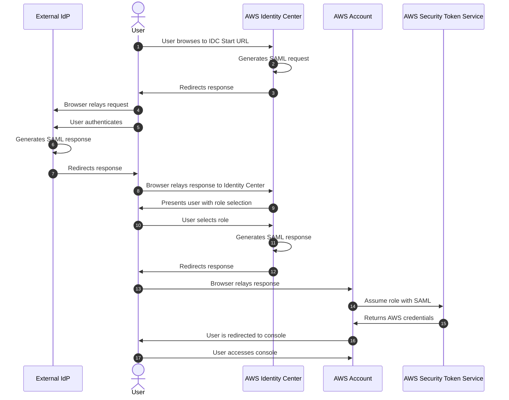

```mermaid
sequenceDiagram
    participant eidp as External IdP
    actor user as User
    participant idc as AWS Identity Center
    participant account as AWS Account
    participant sts as AWS Security Token Service
    autonumber
    user->>idc: User browses to IDC Start URL
    idc->>idc: Generates SAML request
    idc->>user: Redirects response
    user->>eidp: Browser relays request
    user->>eidp: User authenticates
    eidp->>eidp: Generates SAML response
    eidp->>user: Redirects response
    user->>idc: Browser relays response to Identity Center
    idc->>user: Presents user with role selection
    user->>idc: User selects role
    idc->>idc: Generates SAML response
    idc->>user: Redirects response
    user->>account: Browser relays response
    account->>sts: Assume role with SAML
    sts->>account: Returns AWS credentials
    account->>user: User is redirected to console
    user->>account: User accesses console
```